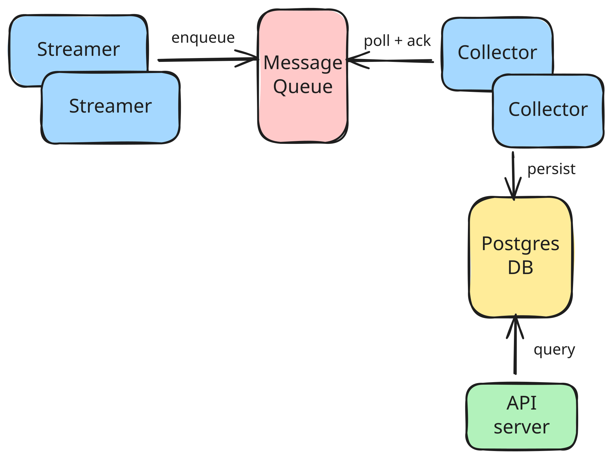

# GPU Telemetry Pipeline (Elastic, Message-Queue Based)

## Overview

This project implements an **end-to-end elastic GPU telemetry pipeline** for an AI cluster.  
It simulates continuous GPU telemetry ingestion, transport, persistence, and querying using a **custom-built message queue**

The system is designed to demonstrate:

- Scalable ingestion and consumption
- Clean system boundaries
- Correct message-queue semantics
- Kubernetes-native deployment
- Idiomatic Go practices
- Thoughtful and transparent use of AI assistance

---

## High-Level Architecture (HLD)



### Architectural Notes

- **Streamers** and **Collectors** are stateless → scale horizontally
- **Message Queue** provides at-least-once delivery semantics
- **PostgreSQL** is the system of record
- **TelemetryRetention** cron job cleans up old entries periodically
- **API Gateway** reads directly from DB (not from collectors)
- **Helm + Kubernetes** manage lifecycle and scaling
- **Kind** is used for local cluster simulation

---

## System Components

### 1. Telemetry Streamer

- Reads telemetry from a CSV file
- Each CSV row is an independent telemetry datapoint
- CSV timestamp is replaced with **current ingestion time**
- Streams telemetry continuously in a loop
- Publishes messages to the custom MQ
- Horizontally scalable


### 2. Custom Message Queue (MQ)

- HTTP-based message queue
- Supports:
  - `Enqueue`
  - `Poll(batchSize)`
  - `Ack(messageID)`
- Backpressure handled via polling
- Deduplication handled at storage layer

#### Delivery Semantics
- At-least-once delivery
- Messages are acknowledged only after successful persistence
- Unacknowledged messages are eligible for redelivery

#### Failure Handling
- Collector crash before Ack → message is retried
- Collector crash after Ack → safe due to idempotent DB inserts
- MQ restart → in-memory state resets

#### Scale Limits
- Designed and tested up to 10 Streamers and 10 Collectors
- Horizontal scaling via Kubernetes replicas


### 3. Telemetry Collector

- Polls messages from MQ
- Persists telemetry into PostgreSQL
- Acknowledges messages **only after successful persistence**
- Idempotent inserts → safe to retry
- Horizontally scalable


### 4. Storage Layer

- PostgreSQL-backed persistent store
- Abstracted via `storage.Store` interface
- Shared by Collector and API
- Deduplication via unique telemetry IDs
- Clean separation between interface and implementation


### 5. API Gateway

- Stateless REST API
- Reads telemetry directly from PostgreSQL
- Structured logging using `zap`
- Correct HTTP semantics and error handling
- Readiness probe via `/healthz`
- Swagger/OpenAPI auto-generated

### 6. Telemetry Retention
- CronJob to periodically clean old entries from DB

---
## Sample User Workflow

1. Deploy the applications

2. Streamers begin publishing telemetry from CSV files

3. Collectors consume and persist telemetry into PostgreSQL

4. User queries available GPUs:
   ```GET /api/v1/gpus```

5. User queries telemetry for a GPU:
   ```GET /api/v1/gpus/{id}/telemetry?start_time=...&end_time=...```

6. Results are returned ordered by timestamp

---

## API Endpoints

| Endpoint | Description |
|--------|-------------|
| GET /api/v1/gpus | List all GPUs |
| GET /api/v1/gpus/{id}/telemetry | Query telemetry by GPU |
| GET /healthz | Readiness probe |

### Telemetry Query Parameters

- `start_time` – Unix timestamp (seconds), optional
- `end_time` – Unix timestamp (seconds), optional

Telemetry is returned ordered by timestamp.

---

## OpenAPI (Swagger)

The OpenAPI specification is **auto-generated** using `swaggo/swag`.

### Generate OpenAPI Spec

```bash
make swagger
```
### Once the API server is running:

```
http://localhost:8081/swagger/index.html
```

## Project Structure
```
.
├── build/              Dockerfiles
│   ├── Dockerfile.api
│   ├── Dockerfile.collector
│   ├── Dockerfile.mq
│   └── Dockerfile.streamer
├── cmd/
│   ├── api/            API server entrypoint
│   ├── collector/      Collector entrypoint
│   ├── mq/             Message queue entrypoint
│   └── streamer/       Streamer entrypoint
├── config/             Config loading
├── deployment/
│   └── helm/           Helm chart
├── docs/               Swagger output
├── model/              Data model struct
├── pkg/
│   ├── api/            HTTP handlers & routing
│   ├── client/         MQ client
|   ├── collector/      Telemetry collector
|   ├── mq/        Message queue
│   ├── storage/        DB
|   ├── streamer/       Telemetry streamer
|   ├── util/           Zap logger wrapper 
├── Makefile
└── README.md
```

## Build & Run (Local)

### Prerequisites

The project has been tested with the following tool versions.  
Other compatible versions may work as well.

- **Go** ≥ 1.24  
- **Docker** ≥ 25.x  
- **kubectl** ≥ 1.34  
- **Helm** ≥ 3.14  
- **Kind** ≥ 0.31.0  

Please ensure the tools are installed and available in your `PATH`.

Installation guides:
- https://go.dev/doc/install
- https://docs.docker.com/get-docker/
- https://kubernetes.io/docs/tasks/tools/
- https://helm.sh/docs/intro/install/
- https://kind.sigs.k8s.io/docs/user/quick-start/


### Environment validation

```
make preflight
```

### Unit testing
Run unit tests
```
make test
```
Run unit tests with coverage
```
make coverage
```
### Kind cluster
Create cluster
```
make kind-create
```
Delete cluster
```
make kind-delete
```

### Docker image build/clean
Builds Docker images:

- API
- Collector
- Streamer
- MQ
```
make docker-build
```
Remove Docker images:
```
make docker-clean
```
### Load Docker image into Kind
Load docker images into Kind
```
make kind-load
```

### Helm Deployment
Deploy chart to `telemetry` namespace
```
make deploy
```
Uninstall chart
```
make undeploy
```
### Accessing the API locally

The API service can be accessed via port-forwarding:

```bash
kubectl port-forward svc/telemetry-api 8081:8081 -n telemetry
```
---
## Helm Configuration
Application configuration is defined in `values.yaml` and injected into pods
as environment variables via the Helm chart.

For local development, a `.env.example` file is provided for convenience.
### Scaling
Collectors and Streamers are stateless and can be scaled by adjusting
the replica count in `values.yaml`:
```
collector:
  replicas: 2

streamer:
  replicas: 1
```
### Telemetry retention
Periodic cleanup of old telemetry data via `CronJob`
```
retention:
  enabled: true
  retentionDays: 1
```
---
## Observability

- Structured logging using `zap`
- Component-level log separation
- Errors include contextual fields (GPU ID, message ID, etc.)
- Kubernetes readiness probe exposed via /healthz

---
## Troubleshooting

### Resetting PostgreSQL data (development only)

If you need to reset the local PostgreSQL state during development,
the persistent volume claim can be deleted:

```bash
kubectl delete pvc data-telemetry-postgres-0 -n telemetry
```
---
## Design Tradeoffs

### HTTP-based Queue vs gRPC / Binary Protocol
**Pros**
- Rapid prototyping
- Apt for assignment usecase

**Cons**
- No streaming or long-lived connections


### Single-instance MQ vs Distributed MQ
**Pros**
- Avoids complexity of leader election, coordination and partitioning

**Cons**
- Single point of failure
- Limited horizontal scalability


### In-memory Queue vs Durable Queue
**Pros**
- Simple implementation
- Faster message access

**Cons**
- Messages lost on MQ microservice restart
- No replay capability


### At-least-once vs Exactly-once Delivery
**Pros**
- Prevents data loss under failure
- Simpler and more reliable semantics

**Cons**
- Duplicate messages possible

### Deduplication at Storage vs Queue
**Pros**
- Centralizes system of record
- Simplifies MQ design

**Cons**
- Additional database overhead


### Pull-based Consumption vs Push-based Delivery
**Pros**
- Collectors control backpressure
- Predictable load handling

**Cons**
- Inefficient when queue is idle


### Batch Polling vs Single-message Processing
**Pros**
- Higher throughput
- Fewer database transactions

**Cons**
- Larger retry scope on partial failures

### Custom PostgreSQL vs Bitnami / Managed Chart
**Pros**
- Rapid prototyping and avoids legacy bitnami charts
- Explicit schema ownership

**Cons**
- No built-in HA, backups, or upgrades
- More operational responsibility


### No Rate Limiting at Ingestion
**Pros**
- Simple streamer implementation
- Maximizes ingestion speed

**Cons**
- Risk of downstream pressure
- Relies on MQ and collectors to absorb bursts

### No Replay / Backfill Support
**Pros**
- Reduced storage and complexity
- Clear data lifecycle

**Cons**
- Historical reprocessing not possible
- Harder to recover from logical bugs

### No Autoscaling (HPA)
**Pros**
- Predictable and deterministic behavior
- Easy to reason about scaling

**Cons**
- Manual intervention required
- No dynamic response to load

### Logs-first Observability vs Metrics & Tracing
**Pros**
- Simple setup, effective debugging

**Cons**
- Limited visibility into latency and throughput

### CSV telemetry data ingestion
- Each streamer replica reads own CSV and acts as source of data

---
## Use of AI Assistance

AI (ChatGPT) was used **as an assistance and acceleration tool** during development. All final architectural decisions, correctness guarantees, production hardening, and validation logic placement were performed manually by the developer.
The system design, debugging, and final correctness required **significant manual reasoning**, iteration, and correction.

---
### End-to-End Development Workflow Overview

The project was developed in the following ordered phases:

1. Architecture design and trade-off analysis
2. Project & repository bootstrapping
3. Code bootstrapping (API, storage, validation)
4. Unit test development
5. Build & local development environment setup
6. Documentation & README finalization

---
### 1. Initial Architecture Discussions

**Prompt examples (paraphrased):**
- Help me design an elastic GPU telemetry pipeline with a custom message queue in Go based on requirement "assignment-document-text".
- How should streamer, collector, and custom message queue interact if they scale dynamically?
- Should the custom MQ use HTTP or gRPC considering scale of assignment?
- Considering scale help me in defining scope of the message queue.

**AI contribution:**
- Helped outline the initial component set:
  - Streamer
  - Message Queue
  - Collector
  - API
  - Storage
- Validated that streamers and collectors should be stateless.
- Reasoned that HTTP is sufficient to handle transport for MQ.
- Helped to define a reasonable outline and scope for the Message Queue.

**Where AI fell short:**
- Early suggestions underestimated **coordination problems with multiple streamers**.
- Initial guidance did not clearly explain how **multiple streamers enqueueing identical GPU IDs** should be handled.
- Required manual clarification that **GPU ID is not a unique telemetry key**, and that **UUID-based event IDs** are required.

**Manual intervention:**
- Explicitly defined telemetry identity as:

`telemetry_id = UUID (generated by streamer)`

`gpu_id = stable GPU UUID`
- Moved deduplication responsibility **out of the MQ** and **into storage**.

### 2. Project / Repository Bootstrapping

####  What AI helped with
- Validate the overall system architecture against the problem statement
- Identify required components (Streamer, MQ, Collector, API, Storage)
- Propose an initial folder structure aligned with Go and Kubernetes best practices

#### Prompts Used

- Suggest a clean monorepo folder structure for a Go-based microservices system to be deployed on Kubernetes


#### Where AI Fell Short

- Missed few things in initial responses like Makefile, build folders etc.
- Required some restructuring

#### Manual Intervention

- Repository layout finalized manually
- Makefile, docker build, helm folders were added manually

---
### 3. Code bootstrapping

**AI assistance was used to:**
- Generate initial Go skeletons for services
- Draft interface definitions (e.g., `storage.Store`)
- Propose idiomatic Go patterns (table-driven tests, interfaces, logging)

**Example prompts used:**
- Generate boilerplate code for custom message queue, api server, collector and streamer
- As a Go expert generate code for Go collector that polls a custom MQ and persists data
- Help me design a storage interface for telemetry persistence
- Rewrite this handler using idiomatic Go error handling and zap logging
- I need code for an HTTP based Message queue with enqueue, poll and ack handlers
- Suggest a PostgreSQL schema for time-series GPU telemetry data.
- Provide example SQL queries for time-range telemetry retrieval.
- Help to implement API server with following routes
- Implement storage pkg with methods to insert telemetry data into DB and read telemetry data from DB as per optional start time and end time query parameters received from API request
- Implement streamer pkg to read data from CSV file and push into message queue. 


**Where AI fell short:**
- CSV parsing logic initially failed on malformed input and quoting issues
- Some generated code assumed ideal inputs and lacked defensive checks
- Required to and fro guidance to achieve working output

**Manual intervention required:**
- Debugging CSV parsing issues caused by inconsistent quoting and delimiters
- Fixing interface mismatches (`Close`, `Insert`, `Ping` methods missing)
- Correcting error-handling logic to avoid fatal crashes in Kubernetes
- Ensuring correct database reconnection and readiness probe

---
### 4. Unit test development

**Example prompts used:**
- Write list format unit tests for this HTTP handler
- Add test cases for invalid query parameters and dependency failures

**AI assistance was used to:**
- Identify key test cases (happy path, invalid input, dependency failure)
- Generate example HTTP handler tests using `httptest`

**Where AI fell short:**
- Initial tests were incomplete and did not cover interface contract mismatches
- Mock implementations were missing required methods

**Manual intervention required:**
- Completing mock implementations to fully satisfy `storage.Store`
- Fixing test setup to correctly inject URL params
- Expanding test coverage for:
  - Invalid `start_time` / `end_time`
  - Storage failures (`GPUExists` error, `Telemetry` fetch failure)
---
### 5. Build and deployment environment

**Example prompts used:**
- Build a Makefile to run tests, build images, load into Kind, and deploy via Helm
- Help me design Helm charts for multiple microservices
- How to install a kind cluster for local development
- Build manifests to deploy Postgres without using any 3rd party or open source charts or operators
**AI assistance was used to:**
- Draft a multi-service Makefile
- Suggest Helm chart structure
- Propose Kubernetes deployment manifests

**Where AI fell short:**
- Helm dependency handling (PostgreSQL) required manual debugging
- Kubernetes networking and service discovery issues required manual fixes
- Environment variable mapping via Viper was initially incorrect

**Manual intervention required:**
- Debugging Postgres connectivity issues in Kubernetes
- Fixing environment variable propagation (`POSTGRES_DSN`)
- Adjusting readiness probes to avoid incorrect failures
- Ensuring Kind image loading semantics were correct

---

## 6. Documentation & Design Artifacts
**Prompt example**
- Give me a single file in github markdown code language based on following Makefile.

**AI assistance was used to:**
- Draft README structure
- Improve clarity of design trade-offs
- Generate architectural explanations

**Manual intervention required:**
- Ensuring documentation matches actual behavior
- Correcting misleading or oversimplified AI-generated explanations
- Refining wording to be interview-appropriate and technically precise

---

## Some more examples where manual intervention was required 

## 1. Storage Layer Decisions (SQLite → PostgreSQL)

### Early Storage Suggestion

**AI suggestion (early):**
- Use SQLite for simplicity and persistence.

**Why this fell short:**
- SQLite does not scale across multiple collector replicas.
- SQLite file locking becomes problematic in Kubernetes.
- Conflicts with the requirement that collectors scale dynamically.

**Manual correction:**
- Storage was redesigned to use **PostgreSQL** as the system of record.
- API and collectors were updated to **read/write directly to Postgres**.
- SQLite was fully removed from the design.

**Lesson learned:**
> AI tends to optimize for simplicity unless explicitly constrained by scalability requirements.

---

## 2. Streamer CSV Parsing Failures

### CSV Handling

**Prompt examples:**
- “Fix this streamer CSV parsing code”
- “Why am I seeing missing value field continuously?”

**AI contribution:**
- Suggested using `encoding/csv`
- Added `LazyQuotes`, `FieldsPerRecord = -1`

**Where AI fell short:**
- Assumed column positions instead of header-based parsing

**Manual intervention:**
- Added debug logging of raw rows
- Switched to **header-based column mapping**
- Confirmed actual structure

**Outcome:**
Streamer parsing became robust only after **manual inspection of real CSV rows**.

---

## 3. Message Queue Semantics & ACK Handling

### MQ + Collector Interaction

**Prompt examples:**
- “Is it doing deduplication by any chance?”
- “Do we have ack semantics?”

**AI contribution:**
- Suggested at-least-once delivery
- Introduced Poll + Ack model

**Where AI fell short:**
- Initial explanations blurred responsibility between MQ and storage
- Did not clearly enforce “ACK only after persistence”

**Manual intervention:**
- Explicitly defined:
- MQ is **delivery-only**
- Storage enforces idempotency
- Collector ACKs **after successful DB insert**

**Result:**
A clean, explainable message-processing pipeline suitable for interviews.

---

## 4. API Design & Data Ownership

### API vs Collector Confusion

**Prompt examples:**
- “Why can’t API ask collector?”
- “Collectors scale — how will API handle this?”

**AI contribution:**
- Explained standard microservice patterns

**Where clarification was needed:**
- Reinforced that **API must not depend on collectors**
- Clarified that **database is the contract boundary**

**Manual decision:**
- API reads directly from Postgres
- Collector is write-only
- Clear ownership boundaries

---

## 5. Configuration & Environment Variables (Viper Issues)

### Config Loading Problems

**Prompt examples:**
- “Why env is present but config is empty?”
- “POSTGRES_DSN is required but env exists”

**AI contribution:**
- Suggested Viper usage
- Introduced `AutomaticEnv`

**Where AI fell short:**
- Mixed dot-notation and ENV-style keys
- Overcomplicated config mapping
- Caused silent misconfigurations in Kubernetes

**Manual fix:**
- Abandoned dot-based config
- Standardized on **ENV-only configuration**
- Created separate configs for API and Collector

**Lesson learned:**
> For Kubernetes, ENV-only configs are clearer and safer than hybrid approaches.

---

## 6. Helm & PostgreSQL Deployment Issues

### PostgreSQL Image & Helm Dependency Problems

**Prompt examples:**
- “Why image pull is failing?”
- “Why postgres worked before but not now?”

**AI contribution:**
- Suggested Bitnami PostgreSQL chart
- Provided values.yaml structure

**Where AI fell short:**
- Did not anticipate Bitnami Postgres Helm Chart is no longer open source
- Image tag availability issues

**Manual intervention:**
- Debugged image pull failures manually
- Considered shipping Postgres manifests directly

---

## 7. Unit Testing & Mock Failures

### API Handler Unit Tests

**Prompt examples:**
- “Write UT for this handler”
- “Cover invalid end_time testcase”

**AI contribution:**
- Provided table-driven test structure
- Identified missing test cases

**Where AI fell short:**
- Mock implementations were incomplete
- Missed required interface methods (`Insert`, `Close`)
- Tests initially failed due to missing router context

**Manual fixes:**
- Completed mock implementations
- Injected `chi.RouteContext` correctly
- Added error-path tests:
- `GPUExists` failure
- `Telemetry` fetch failure

---

## 8. Makefile & Build System

**AI contribution:**
- Drafted a comprehensive Makefile
- Suggested targets for test, build, deploy, swagger

**Manual improvements:**
- Fixed Windows compatibility issues
- Clarified Kind image loading
- Documented Makefile commands explicitly in README

---

## Summary of AI vs Manual Work

| Area | AI Accelerated | Manual Required |
|----|----|----|
Architecture | Initial outline | Final decisions |
Streamer parsing | Skeleton | Debugging real data |
Storage choice | Suggested SQLite | Migrated to Postgres |
MQ semantics | Concepts | Correct ACK behavior |
Config handling | Viper usage | ENV-only redesign |
Helm/Postgres | Values structure | Image/debug fixes |
Unit tests | Structure | Correctness & mocks |

---

## Final Assessment

AI significantly **accelerated iteration speed**, but:

- **Did not replace architectural judgment**
- **Did not handle real-world edge cases**
- **Required continuous human validation**

The final system reflects **intentional decisions**.